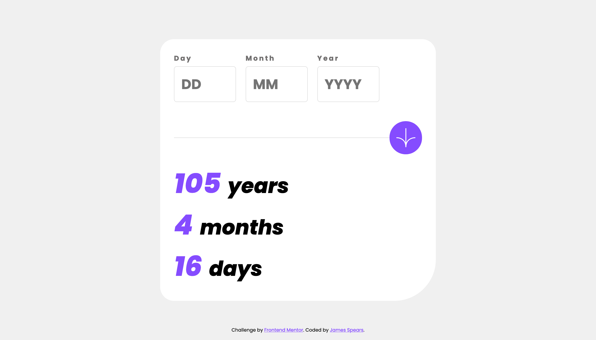

# Frontend Mentor - Age calculator app solution

This is a solution to the [Age calculator app challenge on Frontend Mentor](https://www.frontendmentor.io/challenges/age-calculator-app-dF9DFFpj-Q). Frontend Mentor challenges help you improve your coding skills by building realistic projects.

## Table of contents

- [Frontend Mentor - Age calculator app solution](#frontend-mentor---age-calculator-app-solution)
  - [Table of contents](#table-of-contents)
  - [Overview](#overview)
    - [The challenge](#the-challenge)
    - [Screenshot](#screenshot)
    - [Links](#links)
  - [My process](#my-process)
    - [Built with](#built-with)
    - [What I learned](#what-i-learned)
    - [Useful resources](#useful-resources)
  - [Author](#author)

## Overview

### The challenge

Users should be able to:

- View an age in years, months, and days after submitting a valid date through the form
- Receive validation errors if:
  - Any field is empty when the form is submitted
  - The day number is not between 1-31
  - The month number is not between 1-12
  - The year is in the future
  - The date is invalid e.g. 31/04/1991 (there are 30 days in April)
- View the optimal layout for the interface depending on their device's screen size
- See hover and focus states for all interactive elements on the page
- **Bonus**: See the age numbers animate to their final number when the form is submitted

### Screenshot



### Links

- Solution URL: [Age Calculator GitHub](https://github.com/jamesspearsv/age-calculator)
- Live Site URL: [Age Calculator Live Site](https://jamesspearsv.github.io/age-calculator/)

## My process

### Built with

- Semantic HTML5 markup
- CSS custom properties
- Flexbox
- Mobile-first workflow
- [Webpack](https://webpack.js.org)
- [HTML-Webpack-Plugin](https://github.com/jantimon/html-webpack-plugin)

### What I learned

There were several concepts that I wanted to practice in this project. Cheif among them was the Contraints Validaiton API in javascript. I wrote all the validation functions in `validation.js`. I think that I now have a good understanding of the basics of this web API. I am most proud of this function that I wrote to check the validity of the most recently focused field. This function is called anytime a form input loses focus so that if the user enters data, if there is any invalid data the user can receive appropriate feedback.

```
const validateField = (field) => {
    const validity = field.validity;

    // valueMissing
    if (validity.valueMissing) {
      field.setCustomValidity("Required");
      return false;
    }

    // rangeUnderflow and rangeOverflow
    if (validity.rangeUnderflow || validity.rangeOverflow) {
      if (field.name === "day") {
        field.setCustomValidity("Must be a valid day");
      }

      if (field.name === "month") {
        field.setCustomValidity("Must be a valid month");
      }

      return false;
    }

    // badInput
    if (validity.badInput) {
      field.setCustomValidity("Must be a number");
      return false;
    }

    // patternMismatch
    if (validity.patternMismatch) {
      field.setCustomValidity("Must be a valid year after 1900");
      return false;
    }

    // future date
    if (field.name === "year" && field.value > date.getFullYear()) {
      field.setCustomValidity("Cannot be future year");
      return false;
    }

    // no error
    field.setCustomValidity("");
    return true;
  };
```

I also am happy with the overall organization of my project. Overtime, I have learned a few different ways to organize my projects' code. I am a big fan of the module pattern using factory functions and IIFEs. For this project, I used that pattern to seperate the code that controls form validation, DOM interaction, and core app logic into three seperate modules. I then imported each of these modules into `main.js` where I could use them to controll different parts of the app depending on user actions. Along simialar lines, I also used webpack for this project to bundle all my source code into a distribution packedge. The final tree in my `/src` end up like this:

```
── src
    │  
    ├── js
    │   ├── calc.js
    │   ├── validation.js
    │   └── view.js
    ├── main.js
    ├── styles
    │   ├── desktop.css
    │   ├── main.css
    │   └── reset.css
    └── template.html
```

One smaller this that I learned and think will be very useful is this "previous sibling selector" pattern in CSS. I was having trouble selecting the previousl sibling of an element with a spefic class to add the error styling when needed. After some Googling I learned that the `:has()` function combined with the sibling selector to select an element that has the specified following sibling. The specific rule I wrote is below:

```
label:has(+ input.invalid) {
 color: var(--color-light-red);
}
```

### Useful resources

I completed this project with the help of several online resouces

- [MDN Constraint Validation API Guide](https://developer.mozilla.org/en-US/docs/Web/HTML/Constraint_validation) - This guide helped me better understant the numberous types of validity states, which HTML elements can have which errors, and how to access these validity properties.
- [CSS Tricks Form Validation Tutorial](https://css-tricks.com/form-validation-part-2-constraint-validation-api-javascript/) - This tutorial was instrumental in helping me structure the pattern of my own form validation functions.
- Chat GPT - I often turned to Chat GPT to ask more detailed questions that I was unable to solve with a Google search. I found most often the using Chat GPT helped me 'talk' through my questions and clear up my understandings.

## Author

- Website - [James Spears, V](https://jamesspearsv.com)
- Frontend Mentor - [@jamesspearsv](https://www.frontendmentor.io/profile/jamesspearsv)
